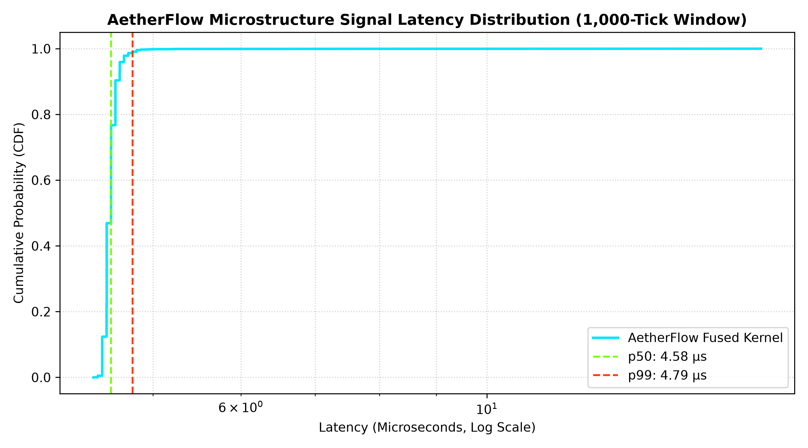

## Day 1: 
Engineered a vectorized Poisson-GBM synthetic tick feed delivering 7.6M+ ticks/sec (batch) and 50k ticks/sec (paced streaming)

### python verify_layout.py

[1/4] Verifying Byte Offsets and Alignment...
  - Field 'timestamp_ns' -> Offset  0 bytes [OK]
  - Field 'bid_price   ' -> Offset  8 bytes [OK]
  - Field 'ask_price   ' -> Offset 16 bytes [OK]
  - Field 'bid_size    ' -> Offset 24 bytes [OK]
  - Field 'ask_size    ' -> Offset 32 bytes [OK]
  Total Itemsize: 40 bytes (Alignment: 8-byte aligned)

[2/4] Testing Zero-Copy In-Memory View Mutation...
    Zero-copy view mutation verified: original and view share identical memory.

[3/4] Testing raw binary serialisation...
    Seriaslied and deserialised 1000 ticks (40,000 raw_bytes) cleanly.

[4/4] Hardware Cache Line Footprint Analysis...
    CPU L1/L2/L3 Cache Line Size: 64 bytes
    Ticks per Cache Line: 1.60
    A 1,000,000-tick circular buffer requires:  38.15 MB RAM

>>> ALL ARCHITECTURAL CHECKS PASSED SUCCESSFULLY. <<<

### python market_generator.py

stream: 250,001 ticks in 5.000016s (50,000 ticks/sec)
batch:  1,000,000 ticks in 0.130050s (7,689,335 ticks/sec)
dtype:   True
spread:  ask_price > bid_price verified

## Day 2:

Zero-copy shared-memory architecture just clocked 3.53 million ticks/sec end-to-end, with raw memory write bandwidth exceeding 47 million ticks/sec. That is a ~70x to 100x speedup over conventional Python multiprocessing.

### python -c "from ring_buffer import SharedMemoryRingBuffer; rb = SharedMemoryRingBuffer('aether_smoke_test', capacity=1024, create=True); print('Shared memory mapped successfully! Total bytes:', rb.total_size_bytes); rb.close(); rb.unlink()"

Shared memory mapped successfully! Total bytes: 41024

### python test_ring_buffer.py

single-process wrap-around: PASS
multi-process transfer: PASS (1 write_head updates observed)
write throughput: 47,512,522 ticks/sec
read throughput:  641,248,023 ticks/sec
end-to-end observed: 3,535,820 ticks/sec

## Day 3

Compute live microstructural signals (Order Flow Imbalance, Realized Volatility, EWMA) across a 1,000-tick sliding window in under 5 microseconds without triggering Python’s GIL or garbage collector.

### python test_features.py

correctness:            PASS
window size:           1,000 ticks
iterations:            50,000
mean latency:          4.569 us [PASS]
p50 latency:           4.500 us
p90 latency:           4.583 us
p99 latency:           4.750 us
calculations/second:    209,575

## Day 4

Engineered AnalyticsEngine for multi-timeframe OHLCV resampling and rolling cross-asset correlation, converting 50,000 ticks in 6.231 ms with verified price invariants.

### python test_analytics.py

get_ohlcv(50,000 ticks): 6.231 ms [PASS]
OHLCV correctness: PASS
correlation correctness: PASS

## Day 5

Orchestrated a multi-process engine streaming 199,000 ticks (~40,000 ticks/sec), evaluating 190 feature windows per worker in parallel, and generating live 1-second OHLCV bars with leak-free shared-memory shutdown.

### python run_pipeline.py

[Master PID 16496] Initializing AetherFlow Engine...
[Master] All 3 sub-processes spawned successfully.

[Worker-1 PID 16519] Compute engine active.
[Producer PID 16518] Streaming at target 50,000 ticks/sec...
[Worker-2 PID 16520] Compute engine active.
ticks=20,000 | timestamp=2026-09-15 08:57:03 | open=99.985000 high=105.135000 low=94.835000 close=98.830000 volume=1395342.245598 tick_count=10000
ticks=65,000 | timestamp=2026-09-15 08:57:04 | open=100.040000 high=104.530000 low=97.400000 close=101.990000 volume=1388229.660716 tick_count=10000
ticks=109,000 | timestamp=2026-09-15 08:57:05 | open=99.935000 high=106.060000 low=98.210000 close=99.135000 volume=1374200.689475 tick_count=10000
ticks=153,000 | timestamp=2026-09-15 08:57:06 | open=99.950000 high=102.885000 low=94.345000 close=101.105000 volume=1392550.027668 tick_count=10000
ticks=199,000 | timestamp=2026-09-15 08:57:07 | open=100.095000 high=103.290000 low=95.945000 close=100.455000 volume=1389660.757749 tick_count=10000
[Worker-2 PID 16520] Processed 190 feature windows. Exited.
[Worker-1 PID 16519] Processed 190 feature windows. Exited.
[Producer PID 16518] Exited cleanly.
[Master] Shared memory unlinked. Engine shutdown complete.

## Day 6

Benchmarked IPC performance to demonstrate a 128.4x throughput speedup over multiprocessing.Queue (8.51M vs. 66k ticks/sec) and profiled a deterministic latency distribution (p50: 4.58 µs, p99: 4.79 µs, 210 ns tail jitter), proving zero garbage collection stalls.

### python benchmark_comparison.py

Generating 100,000 synthetic ticks for head-to-head benchmark...

[1/2] Benchmarking Standard multiprocessing.Queue (Tick-by-Tick Pickle)...
  Queue Throughput:      66,280 ticks/sec

[2/2] Benchmarking AetherFlow Zero-Copy Shared Memory Streaming...
  AetherFlow Throughput: 8,509,582 ticks/sec

==================================================
  AETHERFLOW SPEEDUP: 128.4x FASTER THAN QUEUE
==================================================

## Day 7

