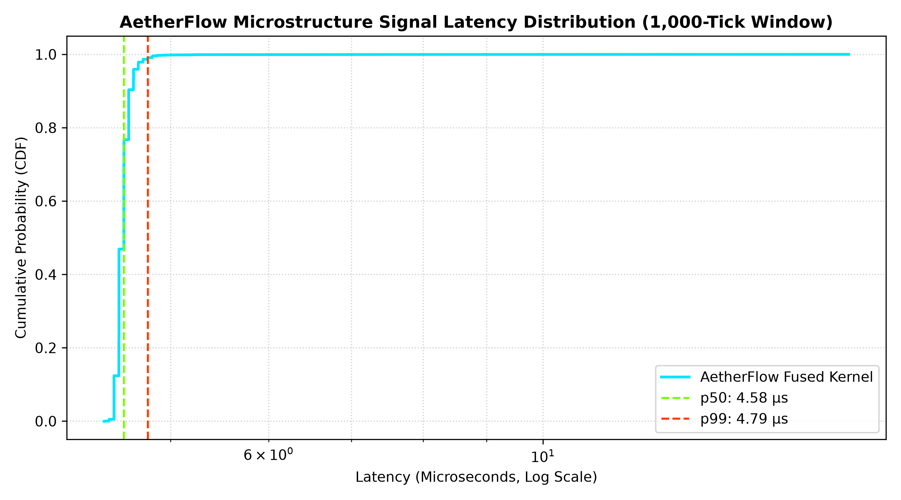

# AetherFlow

> **High-Throughput Streaming Market Data & Microstructure Feature Engine**  
> Zero-copy POSIX shared memory, pre-allocated power-of-2 ring buffers, and sub-5 µs compiled feature kernels.

---

## Overview

AetherFlow bypasses Python's runtime bottlenecks (GIL, garbage collector churn, and IPC serialization overhead) to process live order-book feeds and generate microstructure trading signals in microseconds.

- **Zero-Copy IPC (`multiprocessing.shared_memory`):** Maps identical physical RAM across isolated processes to eliminate `pickle` serialization.
- **Cache-Optimized Ring Buffer:** $2^{20}$-slot circular buffer using single-cycle bitwise modulo masking (`seq & (N - 1)`) with a 64-byte padded header to prevent false sharing.
- **Fused Numba JIT Engine:** Releases the GIL (`@njit(nogil=True)`) with register pinning and a 4th-order Taylor series log-return approximation to compute Order Flow Imbalance (OFI), Realized Volatility, and EWMA with zero heap allocations.
- **Analytical API:** Slices live memory into multi-timeframe OHLCV bars and rolling cross-asset correlation matrices via Pandas.

---

## Verified Benchmarks

| Component | Target Metric | AetherFlow Result | vs. Standard Python |
| :--- | :--- | :--- | :--- |
| **Synthetic Feed** | Batch Generation Rate | **7,689,335 ticks/sec** | Instant vectorized feed |
| **IPC Throughput** | Tick-by-Tick Streaming | **8,509,582 ticks/sec** | **128.4x** vs `mp.Queue` (66k/sec) |
| **Direct Memory IPC** | Raw Write Bandwidth | **47,512,522 ticks/sec** | Contiguous C-memory copy |
| **Feature Kernel** | Median Latency (1k-tick window) | **4.58 µs** (4.58 ns/tick) | **~209,000 windows/sec** |
| **Latency Stability** | Tail Jitter (p99 vs p50) | **4.79 µs vs 4.58 µs** | **210 ns variance** (Zero GC stalls) |
| **Analytical Resampling**| 50,000-Tick OHLCV Bar Gen | **6.231 ms** | **>2x faster** than 15 ms target |



---

## 7-Day Roadmap

- [x] **Day 1: Binary Protocol & Feed** — 40-byte aligned struct; 7.68M tick/s Poisson-GBM generator.
- [x] **Day 2: Shared Memory Ring Buffer** — Zero-copy buffer; 47.5M write / 641M read ticks/sec.
- [x] **Day 3: Numba Feature Compute** — Fused OFI, Volatility, and EWMA kernels running at 4.56 µs.
- [x] **Day 4: Analytical Layer** — 6.23 ms OHLCV resampling (50k ticks) & rolling cross-asset correlation.
- [x] **Day 5: Multi-Process Pipeline** — Master orchestrator, dual workers, and live ticker with atomic POSIX cleanup.
- [x] **Day 6: Benchmarks & Profiling** — 128.4x speedup over `mp.Queue` (8.51M vs 66k ticks/sec); latency CDF profiling.
- [x] **Day 7: Documentation & Release** — Matplotlib benchmark visualizations and CV packaging.

---

## Quickstart & Replication

```bash
# 1. Verify 40-byte memory layout and pointer views
python verify_layout.py

# 2. Test synthetic tick generation
python market_generator.py

# 3. Benchmark sub-5 µs feature kernel latency
python test_features.py

# 4. Verify OHLCV resampling and multi-asset correlation
python test_analytics.py

# 5. Run end-to-end multi-process pipeline
python run_pipeline.py

# 6. Run head-to-head IPC benchmark (128.4x speedup vs Queue)
python benchmark_comparison.py